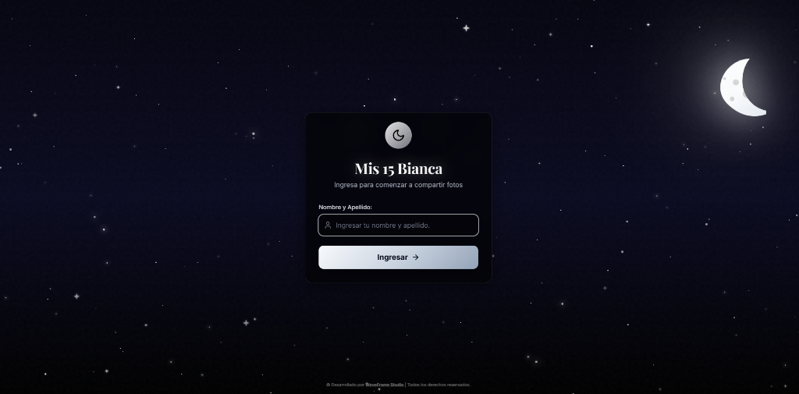
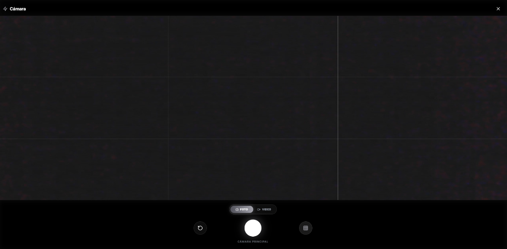
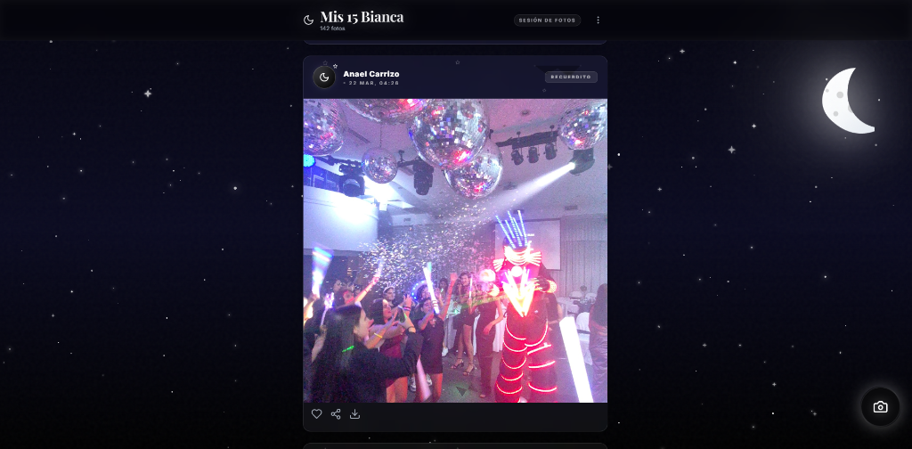
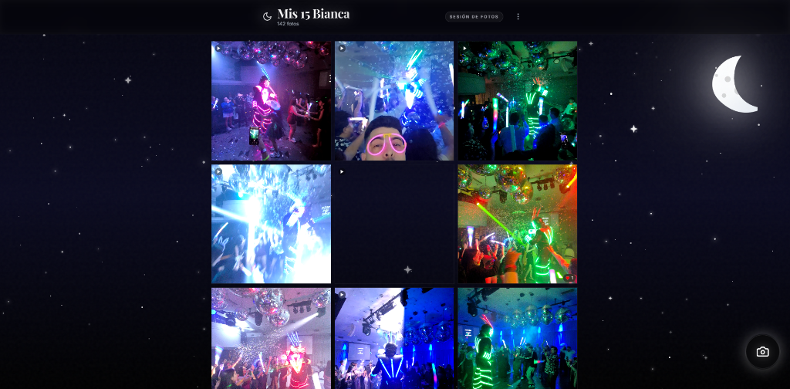

  <h1>📸 PhotoParty</h1>

  
<b>Captura, sincroniza y revive la magia de cada momento en tiempo real.</b>

  
Una plataforma web progresiva y elegante diseñada para eventos sociales con interfaz Glassmorphic premium.

  

    
    
    
    
    
  

---

## ✨ Sobre el Proyecto

**PhotoParty** transforma la manera en que los invitados interactúan y comparten recuerdos durante cualquier evento social. Olvídate de los álbumes dispersos o las fotos perdidas en chats de mensajería; PhotoParty permite a los asistentes tomar fotos al instante desde la cámara de sus dispositivos y sincronizarlas en vivo en una galería interactiva accesible para todos.

Diseñado bajo la estética **Glassmorphism**, el proyecto combina dinamismo, fluidez y efectos de transparencia sofisticados para ofrecer una experiencia estética y funcional de nivel profesional.

---

## ⚡ Características Destacadas

| Función | Descripción |
| :--- | :--- |
| 📸 **Captura Directa** | Integración nativa fluida con la cámara del dispositivo móvil o de escritorio. |
| 🔄 **Sincronización Real-Time** | Actualización instantánea del feed general gracias al motor de suscripciones de Supabase. |
| 💎 **Diseño Glassmorphic** | Estética moderna con efectos de desenfoque, gradientes vibrantes y animaciones sutiles. |
| 📥 **Descarga Masiva en ZIP** | Herramienta integrada para exportar todas las fotografías del evento en alta calidad en un solo clic. |
| ❤️ **Interacción Social** | Sistema interactivo de reacciones y likes para destacar las mejores capturas de la fiesta. |
| 📱 **Experiencia Responsive** | Adaptabilidad perfecta garantizada para smartphones, tablets y pantallas de gran formato. |

---

## 🛠️ Stack Tecnológico

| Tecnología | Rol en la Aplicación |
| :--- | :--- |
| **React 18** | Arquitectura de componentes UI declarativa y reactiva. |
| **TypeScript** | Tipado estático robusto para un código mantenible y seguro. |
| **Vite** | Bundling ultrarrápido y desarrollo frontend de alto rendimiento. |
| **Tailwind CSS** | Sistema de diseño de utilidad y estilos glassmorphism a medida. |
| **Supabase** | Base de datos PostgreSQL, almacenamiento de imágenes y suscripciones Realtime. |
| **JSZip** | Compresión cliente para la descarga masiva de fotografías. |
| **Lucide Icons** | Iconografía vectorizada moderna e intuitiva. |

---

## 🖼️ Vista Previa de la Interfaz

Aquí puedes ver la elegancia y fluidez de la aplicación en acción:

  <table style="border: none;">
    <tr>
      <td align="center" style="border: none;">
        
<b>Pantalla de Inicio</b>

        
      </td>
      <td align="center" style="border: none;">
        
<b>Interfaz de Cámara</b>

        
      </td>
    </tr>
    <tr>
      <td align="center" style="border: none;">
        
<b>Feed de Fotos</b>

        
      </td>
      <td align="center" style="border: none;">
        
<b>Vista de Álbum (Grid)</b>

        
      </td>
    </tr>
  </table>

---

## 🤝 Créditos

Desarrollado con ❤️ por **WaveFrame Studio**.  
*Transformando ideas en experiencias digitales excepcionales.*

---

  © 2024 PhotoParty | Todos los derechos reservados.

